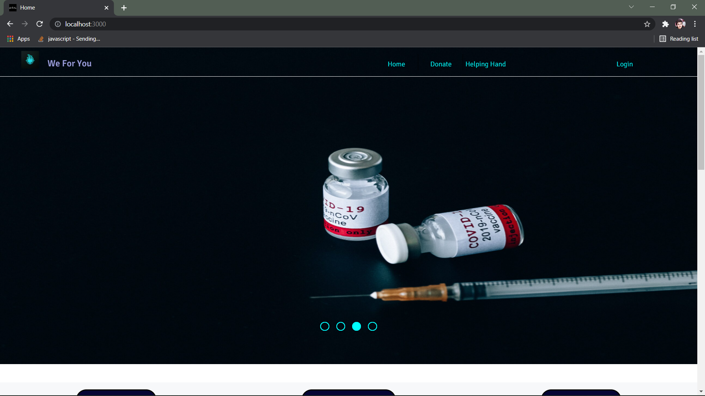
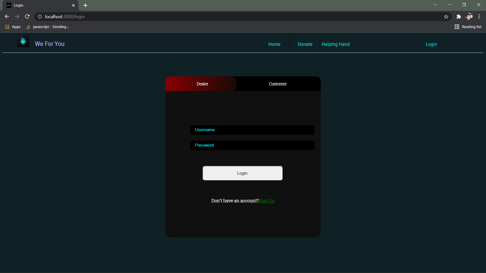
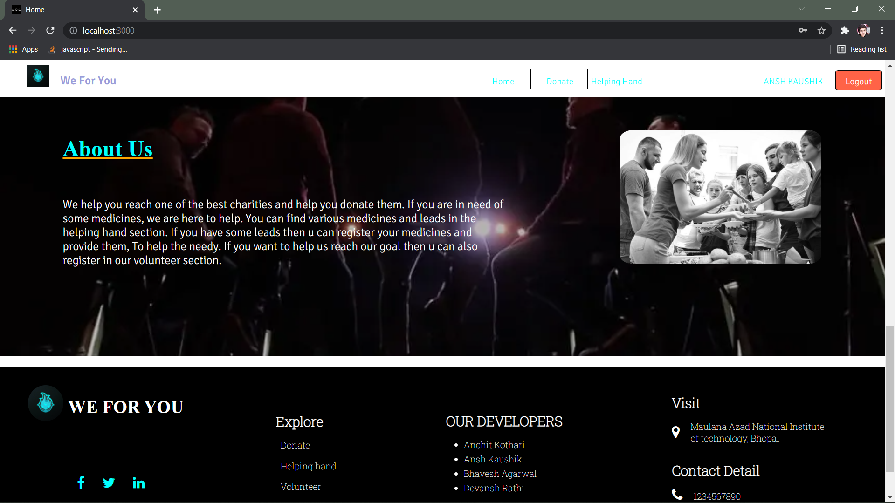
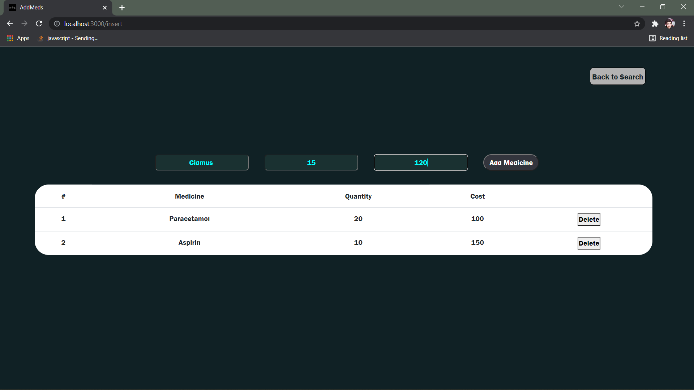
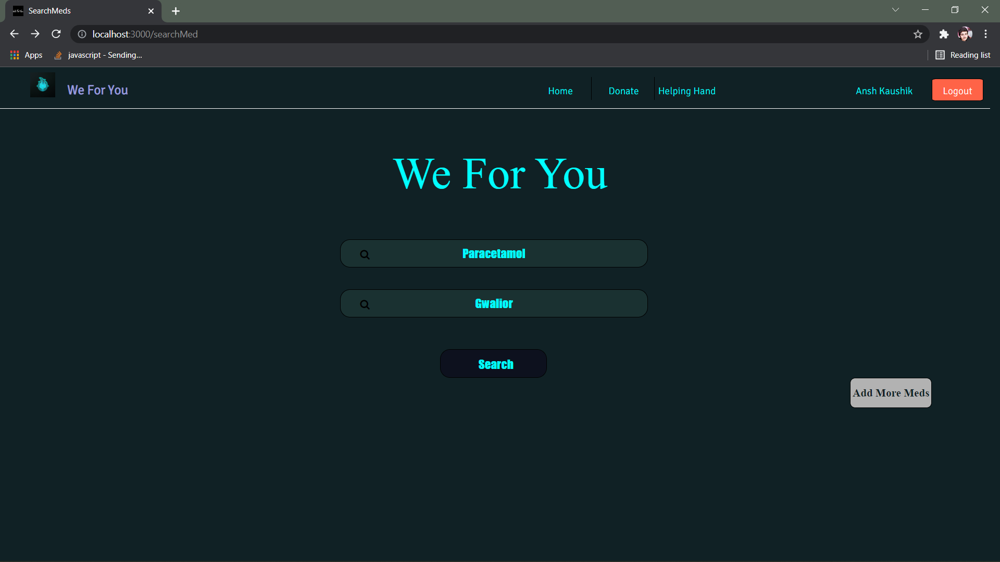

# WE-FOR-YOU

## This is a project for searching for medical resources.

### Software Requirements 
#### Install [Node Js](https://nodejs.org/en/download/). This also includes npm Package manager required for this project.
#### Install [Mongo DB](https://docs.mongodb.com/manual/tutorial/install-mongodb-on-windows/). We are using Mongo DB in this project.

### Installation
#### Clone our repo

```
git clone https://github.com/anshkaushik54/WeForYou.git
cd ./WeForYou/
```
#### Installing all Dependencies
`
npm i
`
#### Setting up .env file

```
SESSION_SECRET - Your Sessions key(string).
PORT - Port you will serve website on...
MONGO_USER - Mongo User name in format 'localhost:Unique_Number'
DB_NAME - Database name you will store data in.
```
### Usage
` nodemon index.js `
###### Website hosted at ` http://localhost:PORT/` 

### Screenshots of application
#### Landing Page
# 
# 
#### Donate Page
# 
#### Login Page
# 
#### SignUp Page
# 
#### After Logging in Page
# 
#### Dealer All Medicine Page
# 
#### Meds Search Page
# 
#### Meds Results Page
# 

### OUR DEVELOPERS

##### Ansh Kaushik
##### Bhavesh Agarwal
##### Devansh Rathi
##### Anchit Kothari


